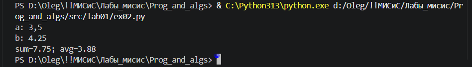

# programming_and_algoritms_labs
I`m doing labs here
  
 
 
 
 
 
 
 
 
 
 
 
 
 
 
 
 
 
 
 
 
 
 
 
 
 
 
 
 
 
 
 
 
 
 
 
 
 
 
 
 
 
 
 
 
 
 
 
 
 
 
 
 

### Helping

**bold**

*italic*

***boldanditalic***

texttexttexttext  
перенос(два пробела)

без переноса
без переноса

> Цитата 

> большие
>
> цитаты

>> вложенные цитаты

- list
- list 

Try to put a blank line before...

> This is a blockquote

...and after a blockquote.

Without blank lines, this might not look right.
> This is a blockquote
Don't do this!

1. First item
2. Second item

- Third item
    - Indented item
    - Indented item
- Fourth item

- Third item
    * Indented item
    + Indented item
- Fourth item

* This is the first list item.
* Here's the second list item.

    I need to add another paragraph below the second list item.

* And here's the third list item.

* This is the first list item.
* Here's the second list item.

    > A blockquote would look great below the second list item.

* And here's the third list item.

